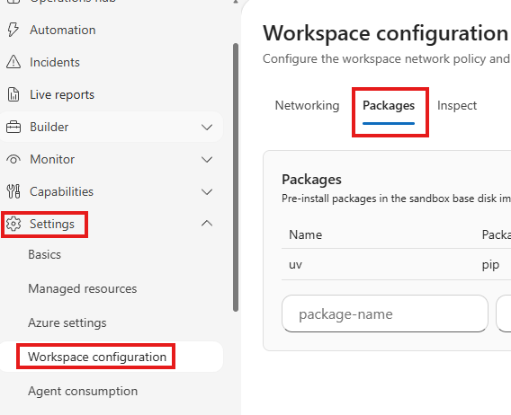
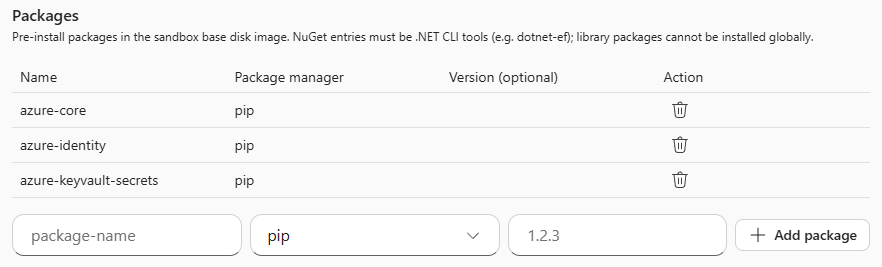
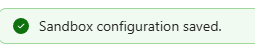
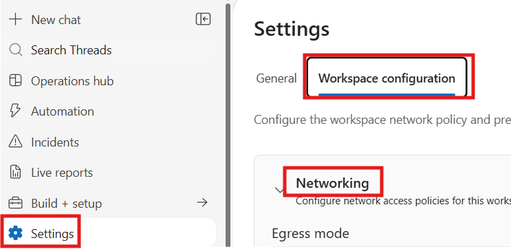
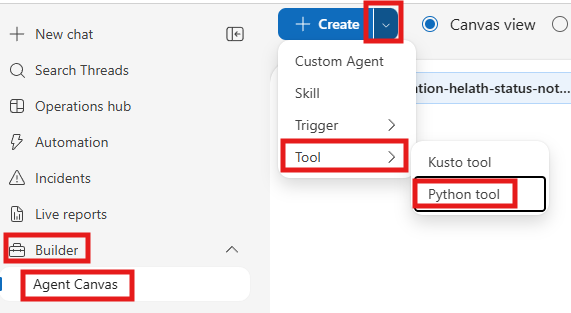
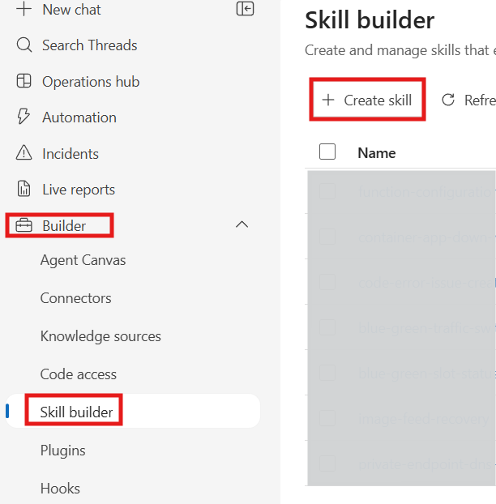

# Configurazione della skill ServiceNow

Questo documento contiene gli step necessari all'installazione del Python tool utilizzato per l'enrichment e lo spostamento dell'incident gestito dall'SRE agent verso un'altra coda.

Seguire gli step indicati di seguito.

## STEP 1: Installare i moduli necessari al tool nel workspace

Questo step farà sì che nell'immagine dei container che eseguono i tool siano installati i componenti necessari all'esecuzione del python tool.

1. Dal portale sre.azure.com, posizionarsi su
    * Settings --> Workspace configuration --> Tab "Packages" _(legacy experience)_ oppure
    * Settings --> Tab "Workspace configuration" --> Packages _(new experience)_



2. Aggiungere i seguenti package. Package manager deve essere `pip`, la versione può essere lasciata vuota.

- `azure-core`
- `azure-identity`
- `azure-keyvault-secrets`



3. Confermare con Save e attendere alcune decina di secondi mentre l'immagine viene aggiornata



## STEP 2: Abilitare l'accesso diretto a Service Now

In questo step viene istruito l'agent a non passare dalla Virtual Network per accedere a Service Now.

Se l'FQND di Service Now è già presente, passare allo step successivo.

1. Posizionarsi su:
    * Settings --> Tab Workspace configuration --> Sezione networking



2. Scendere fino alla sezione **Add a custom host**
3. Digitare nel box sottostante `*.service-now.com` (o entrambe gli FQDN completi di certificazione e produzione)
4. Cliccare su `+ Add`
5. Cliccare su `Save`

## STEP 3: Inserire i secret nel KeyVault

In questo step dovranno essere creati i secret necessari sul KeyVault.

Se i secret elencati di seguito sono già presenti con i valori corretti passare al [prossimo step](#step-4-preparare-la-skill-per-lagent-specifico).

 Le istruzioni per inserire un secret sul keyvault possono essere lette [qui](https://learn.microsoft.com/en-us/azure/key-vault/secrets/quick-create-portal#add-a-secret-to-key-vault).

I nomi seguenti sono statici e **non devono essere sostituiti**:

- `clientid`: contiene il client ID OAuth ServiceNow;
- `clientsecret`: contiene il client secret OAuth ServiceNow;
- `username`: contiene lo username ServiceNow;
- `password`: contiene la password ServiceNow.

> Attenzione: I secret devono essere abilitati e non vuoti.
> Nel template sono riportati soltanto i loro nomi; i valori devono rimanere nel Key Vault e non devono **mai** essere inseriti nella skill.

Inoltre verificare che la **User-Assigned Managed Identity** assegnata all'Azure SRE Agent abbia **accesso in lettura ai secret del Key Vault** indicato.

## STEP 4: Preparare la skill per l'agent specifico

In questo step il template della skill sarà customizzato con i parametri necessari per lo specifico SRE Agent.

### Procedura **automatica**: Placeholder da sostituire

1. Aprire una console PowerShell e posizionarsi sulla cartella dove è presente il file SKILL-template.md.
1. Eseguire lo script `Configura-Skill.ps1`
1. Rispondere sulla console con tutti i valori richiesti
1. Al termine dell'esecuzione sarà generato un file `SKILL.md` con i valori sostituiti e `Configura-Skill.values.json` con il riepilogo dei valori immessi. Lo script, nelle successive esecuzioni, leggerà la configurazione da quel file.
1. Se si desidera modificare le impostazioni, modificare o eliminare il file `Configura-Skill.values.json`

> In caso di **errore** relativo alla **firma** dello script eseguire il seguente comando:

```bash
Set-ExecutionPolicy -ExecutionPolicy RemoteSigned
```

### Procedura **manuale**: Placeholder da sostituire

Il file `SKILL-template.md` e' il template della skill usata dall'Azure SRE Agent per invocare il python tool necessario ad arricchire e riassegnare i ticket ServiceNow.

Prima di aggiungere la skill a un Azure SRE Agent, sostituire tutte le occorrenze dei placeholder `{{...}}` con i valori dell'ambiente di destinazione tramite **Replace All**.

Eseguire i seguenti passi, **solo se non si è eseguita la procedura automatica**:

1. Creare una copia di `SKILL-template.md` per l'Azure SRE Agent da configurare.
2. Eseguire **Replace All** per ciascun placeholder della tabella seguente.
3. Verificare che nel file non rimangano occorrenze di `{{` o `}}`.

| Placeholder | Descrizione | Formato o esempio |
|---|---|---|
| `{{AGENT_MANAGED_IDENTITY_CLIENT_ID}}` | Client ID della User-Assigned Managed Identity usata dall'Azure SRE Agent per autenticarsi ad Azure Key Vault. | GUID |
| `{{SNOW_INSTANCE_NAME}}` | Nome dell'istanza ServiceNow, senza protocollo e senza il suffisso `.service-now.com`. Il tool costruisce l'URL `https://<SNOW_INSTANCE_NAME>.service-now.com`. | Certificazione: `postecertif`; produzione: `postecomprod` |
| `{{KEYVAULT_NAME}}` | Nome della risorsa Azure Key Vault che contiene le credenziali ServiceNow. Inserire soltanto il nome: il template costruisce l'URL `https://<KEYVAULT_NAME>.vault.azure.net/`. | Nome della risorsa Key Vault |
| `{{SOURCE_SYSTEM}}` | Identificativo del sistema sorgente inviato nel campo custom ServiceNow `u_source_system`. | `AINOISRE<SOM>`, dove `<SOM>` e' l'identificativo specifico del SOM |
| `{{SOURCE_QUEUE}}` | Gruppo ServiceNow dal quale e' consentita la riassegnazione. L'aggiornamento viene bloccato se il ticket non appartiene esattamente a questo gruppo. | `AINOISRE_<SOM>` o il nome esatto concordato per il gruppo sorgente |
| `{{DESTINATION_QUEUE}}` | Gruppo ServiceNow destinatario della riassegnazione, inviato nel campo `assignment_group`. | Nome esatto del gruppo di destinazione |

I valori delle code devono corrispondere esattamente ai nomi restituiti da ServiceNow: non abbreviarli, tradurli o modificarne maiuscole, spazi o caratteri.

## STEP 5: Prepara un ticket su Service Now

Predisporre un ticket di test nell'ambiente Service Now target (preferibilmente certificazione).

> **ATTENZIONE**: se sono attualmente agganciati incident response plan alla coda tecnica dell'ambiente dove sarà effettuato il test, disabilitarli temporaneamente per far sì che l'agent non inizi autonomamente l'elaborazione

Il ticket dovrà essere aggiunto alla coda tecnica come specificato da `SOURCE_QUEUE`.

## STEP 6: Installare il Python Tool

In questo step sarà aggiunto il Python tool di arricchimento e spostamento dell'incident.

1. Posizionarsi su
    * Builder --> Agent Canvas --> Create --> Tool --> Python tool _(legacy experinece)_ oppure
    * Builder + setup --> Workflows --> Agent Canvas --> Create --> Tool --> Python tool _(new experience)_



2. Nel campo `Tool Name` specificare `snow-tickets-updater`. Il nome è referenziato dallo skill, quindi non modificarlo.
3. Nel campo `description` specificare `Enrich and reassign a ServiceNow incident using credentials from Azure Key Vault`
4. Nel campo contenente il codice, incollare il contenuto del file `snow-tickets-updater.py.txt` senza effettiare alcuna modifica
5. Posizionarsi nel tab `Test Playground` e valorizzare tutti i campi. Alcuni di questi campi dovranno avere lo stesso valore specificato nello [Step 4](#step-4-preparare-la-skill-per-lagent-specifico), altri sono relativi all'incident preparato nello [Step 5](#step-5-prepara-un-ticket-su-service-now). Utilizzare la tabella [qui sotto](#parametri-per-il-test) per una guida su come valorizzare i parametri
6. Eseguire con il tasto `|> Test`
7. Se gli step sono stati eseguiti nel modo corretto, il test dovrebbe ritornare esito positivo e l'incident dovrebbe essere stato spostato sulla coda specificata nel parametro `DESTINATION_QUEUE`
8. Cliccare su `Create tool`

### Parametri per il test

| Parametro | Valore |
| -- | -- |
| instance | Valore utilizzato per `{{SNOW_INSTANCE_NAME}}` |
| incident_id | ID dell'incident creato nello step 5 |
| sre_thread_id | 743a0a23-e266-4704-8c4a-d0420c36487d (o altro guid) |
| agent_id | test-installazione |
| enrichment_text | <p>TEST</p> |
| source_queue | Valore utilizzato per `{{SOURCE_QUEUE}}` |
| destination_queue |  Valore utilizzato per `{{DESTINATION_QUEUE}}` |
| source_system | Valore utilizzato per `{{SOURCE_SYSTEM}}` |
| survey_system_url | https://TEST.webapp.fabricapps.net/ |
| azure_client_id | Valore utilizzato per `{{AGENT_MANAGED_IDENTITY_CLIENT_ID}}` |
! key_vault_url | https://`{{KEYVAULT_NAME}}`.vault.azure.net/ - sostituire il placeholder |
| timeout_seconds | 20 |

## STEP 7: Creazione della skill

In questo step sarà aggiunta la skill necessaria a richiamare il Python tool appena creato.

> Se la skill è già stata creta precedentemente, eliminarla o modificarla evitando di lasciare più versioni della stessa, evitando di creare ambiguità per l'agente

### Verifiche prima della pubblicazione

Prima di installare la skill sull'Azure SRE Agent, verificare che:

1. non siano rimasti placeholder `{{...}}`;
2. `SNOW_INSTANCE_NAME` contenga il solo nome istanza e non un URL o un hostname completo;
3. `KEYVAULT_NAME` contenga il solo nome del vault;
4. il client ID configurato appartenga alla User-Assigned Managed Identity assegnata all'agente;
5. l'identita' abbia accesso in lettura ai quattro secret richiesti;
6. coda sorgente, coda destinazione e source system corrispondano all'ambiente ServiceNow di destinazione;

### Aggiunta della skill


1. Posizionarsi su
    * Builder --> Skill builder --> Create Skill _(legacy experience)_ o ppure
    * Extensions --> Skill builder --> Create Skill _(new experience)_



2. Nel campo `SKILL.md` incollare il testo del file `SKILL.md` generato dal tool o modificato manualmente
3. Cliccare su create

## STEP 8: istruire l'agente a richiamare lo skill

Per assicurarsi che il subagent incaricato della gestione degli incident utilizzi la skill al termine dell'indagine, aggiungere al relativo incident response plan istruzioni **simili** alle seguenti (personalizzare secondo specificità del vostro agente):

```markdown
Gestione Incident:

- Al termine della valutazione dell'incident, usa la skill `servicenow-incident-enrichment-and-reassignment` per arricchire e riassegnare il ticket al gruppo competente.
- Inserisci nell'enrichment soltanto informazioni supportate dalle evidenze raccolte, includendo quando disponibili:
  1. sintesi, impatto e risorse coinvolte;
  2. root cause o ipotesi meglio supportata;
  3. remediation, stato del ripristino e azioni successive;
  4. classificazione della ricorrenza e tempi MTTR o MTTM.
- Non inserire il link survey nell'enrichment: viene aggiunto automaticamente dal tool.
- Non inviare mai testo generico, placeholder, credenziali, token o log grezzi ad alto volume nel campo `u_enrichment_ai`.
```

La skill deve essere invocata una sola volta per aggiornamento. In caso di `REASSIGNMENT_BLOCKED`, non riprovare e non forzare la riassegnazione. In caso di timeout o errore di rete durante l'aggiornamento, verificare prima lo stato corrente del ticket perché ServiceNow potrebbe avere gia' completato l'operazione.